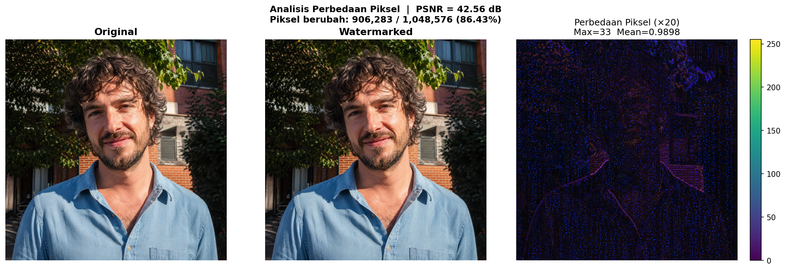
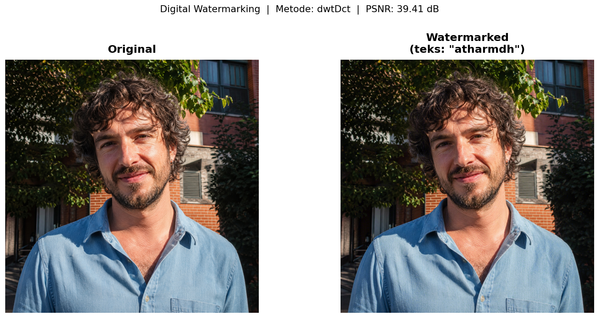
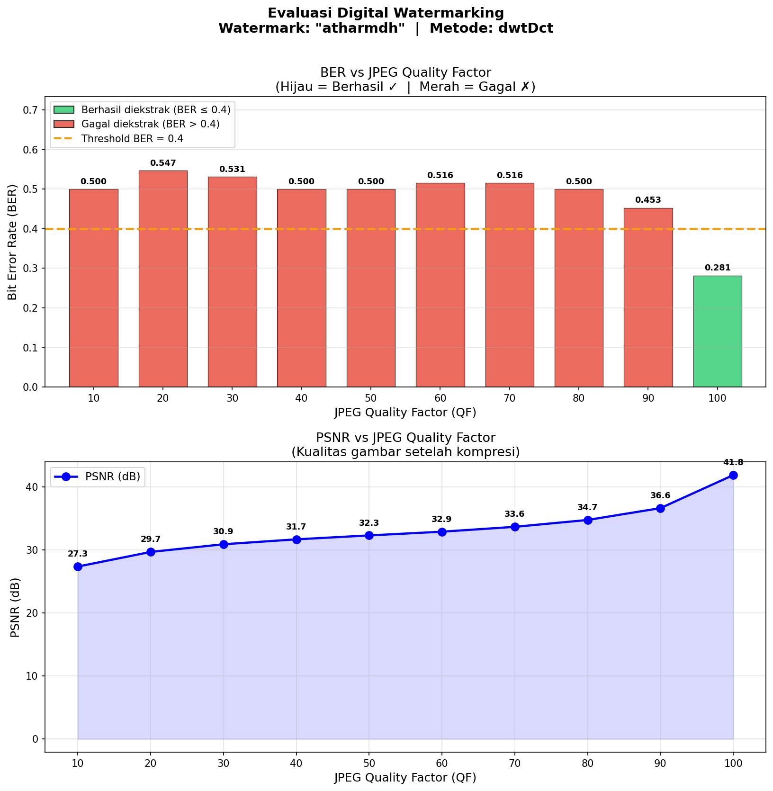

# Digital Watermarking — SISMUL


Proyek ini menyematkan *invisible watermark* ke dalam sebuah foto menggunakan metode **dwtDct**, lalu menguji seberapa kuat watermark tersebut bertahan saat foto dikompresi ulang dengan berbagai tingkat kualitas JPEG (QF 10–100).

---

## Demo

| Original | Watermarked | Pixel Difference |
|:---:|:---:|:---:|
|  |  |  |

---

## How It Works

Metode dwtDct bekerja dalam dua lapisan transformasi frekuensi. Pertama, DWT (Discrete Wavelet Transform) memecah gambar menjadi sub-band frekuensi — memisahkan komponen kasar dan halus dari gambar. Kemudian DCT (Discrete Cosine Transform) diterapkan pada sub-band tersebut, menghasilkan koefisien frekuensi yang mirip dengan yang digunakan JPEG secara internal.

Bit-bit watermark disisipkan di koefisien mid-frequency — area yang cukup kuat untuk bertahan dari gangguan ringan, tapi tidak cukup menonjol untuk terlihat secara visual. Untuk mengekstrak watermark, proses tersebut dibalik, dan bit dibaca kembali dari posisi koefisien yang sama. Keberhasilan ekstraksi diukur dengan BER (Bit Error Rate): nilai 0.0 berarti watermark sempurna terbaca, sedangkan nilai mendekati 0.5 berarti hampir separuh bit salah.

---

## Hasil

### Step 1 — Foto Asli

Foto yang digunakan berukuran 1254 x 1254 piksel, di-resize otomatis ke 1024 x 1024 sebelum embedding agar algoritma dwtDct bekerja stabil.

<p align="center">
  
</p>

---

### Step 2 — Embedding Watermark

Teks watermark `atharmdh` (64 bit, 8 karakter x 8 bit) disisipkan ke dalam foto menggunakan metode dwtDct. Secara visual, foto tidak mengalami perubahan yang terlihat mata.

<p align="center">
  
</p>

Verifikasi dari memori setelah embedding: BER = 0.2812 — sebagian bit berhasil terbaca (18 dari 64 bit salah).

---

### Step 3 — Perbandingan Before / After

Kedua foto ditampilkan berdampingan. Tidak ada perbedaan yang bisa dikenali secara visual. PSNR = 39.41 dB.

<p align="center">
  
</p>

---

### Step 4 — Analisis Perbedaan Piksel

Perbedaan antara foto asli dan foto ber-watermark diperbesar 20 kali agar terlihat. Perubahan tersebar luas karena gambar berukuran besar dengan banyak detail.

<p align="center">
  
</p>

| Metrik | Nilai |
|--------|-------|
| Max perbedaan piksel | 33 dari 255 |
| Rata-rata perbedaan | 0.9898 |
| Piksel yang berubah | 906.283 dari 1.048.576 (86.43%) |
| PSNR | 42.56 dB |

---

### Step 5 — Kompresi JPEG Berbagai Quality Factor

Foto ber-watermark dikompres ulang dengan QF 10, QF 50, dan QF 100 untuk melihat seberapa jauh kompresi merusak detail gambar.

| QF 10 | QF 50 | QF 100 |
|:---:|:---:|:---:|
|  |  |  |
| PSNR: 27.34 dB | PSNR: 32.28 dB | PSNR: 41.84 dB |

Semakin kecil QF, semakin besar kuantisasi koefisien DCT, semakin rusak informasi yang tertanam di dalamnya.

---

### Step 6 — Evaluasi BER vs QF

Grafik di bawah menunjukkan nilai BER dan PSNR di tiap Quality Factor setelah watermark dicoba diekstrak.

<p align="center">
  
</p>

---

## Tabel Hasil Evaluasi

| QF | BER | PSNR (dB) | Status |
|:--:|:---:|:---------:|:------:|
| 10 | 0.5000 | 27.34 | FAIL |
| 20 | 0.5469 | 29.66 | FAIL |
| 30 | 0.5312 | 30.88 | FAIL |
| 40 | 0.5000 | 31.66 | FAIL |
| 50 | 0.5000 | 32.28 | FAIL |
| 60 | 0.5156 | 32.87 | FAIL |
| 70 | 0.5156 | 33.64 | FAIL |
| 80 | 0.5000 | 34.73 | FAIL |
| 90 | 0.4531 | 36.61 | FAIL |
| **100** | **0.2812** | **41.84** | **OK** |

Minimum safe QF: **100** — watermark sebagian terbaca hanya pada kompresi lossless penuh.

---

## Cara Install & Run

```bash
git clone https://github.com/shinjimiami/Watermarking.git
cd Watermarking
python3 -m venv venv
source venv/bin/activate
pip install -r requirements.txt
```

Jalankan berurutan:

```bash
python watermark.py     # embed watermark, hasilkan watermarked.jpg dan comparison.png
python pixel_diff.py    # analisis perbedaan piksel, hasilkan pixel_diff.png
python evaluate.py      # evaluasi semua QF, hasilkan grafik dan hasil kompresi
```

---

## Struktur Folder

```
watermarking-project/
├── watermark.py
├── evaluate.py
├── pixel_diff.py
├── requirements.txt
├── images/
│   ├── original.jpg
│   ├── watermarked.jpg
│   ├── comparison.png
│   ├── pixel_diff.png
│   └── results/
│       └── qf_10.jpg ... qf_100.jpg
└── output/
    └── evaluation_chart.png
```

---

## Kesimpulan

Pada foto ini, watermark hanya sebagian berhasil diekstrak di QF 100 (BER = 0.2812 — di bawah threshold 0.4). Di semua QF di bawahnya, ekstraksi gagal total dengan BER di atas 0.4. Ini terjadi karena gambar berukuran besar (1024x1024 setelah resize) dengan banyak detail frekuensi tinggi — proses kuantisasi JPEG menggeser koefisien DCT yang menyimpan bit watermark, sehingga bit tidak bisa dipulihkan secara akurat.

BER di QF 100 yang tidak mencapai 0.0 (hanya 0.2812) menunjukkan bahwa ada sebagian informasi yang hilang bahkan sebelum kompresi, kemungkinan akibat konversi format dari PNG ke JPEG saat menyimpan hasil embedding ke disk.

---

## Author

Tugas Digital Watermarking — Sistem Multimedia (SISMUL)  
Watermark: `atharmdh`
